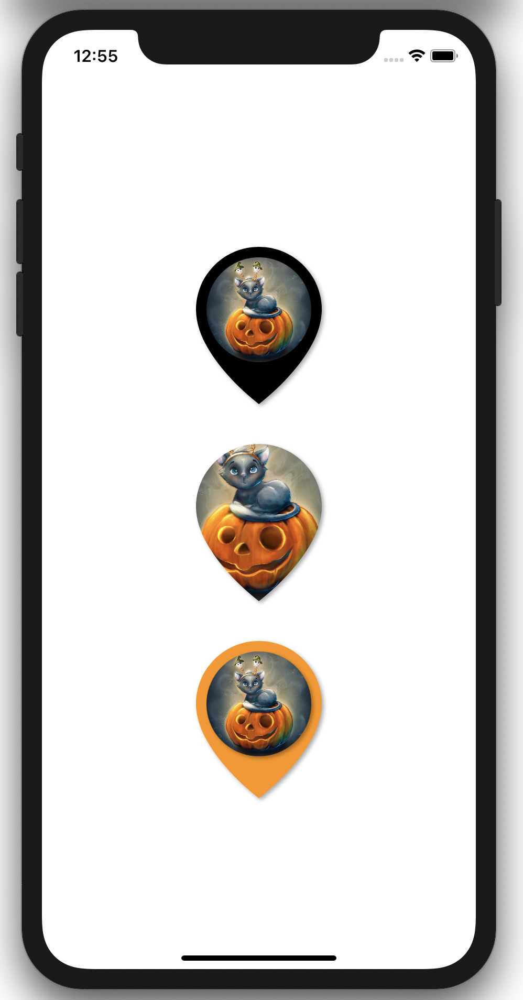

# Drop Pin SwiftUI Shape

A "pin" SwiftUI Shape.

## 

# Installation

Download DropPin.swift and include it in your project.

# Usage

`DropPin` is a `Shape`, so you can use it the same way you would use any other `Shape` such as `Circle()`. In the included project you can see examples.

# Contributing

If you think you can improve the shape, or the demo, feel free to open a pull request.

# License

See LICENSE.

# Credits

Demo image curtesy of [@Steliyana](https://twitter.com/SteliChakarova).
